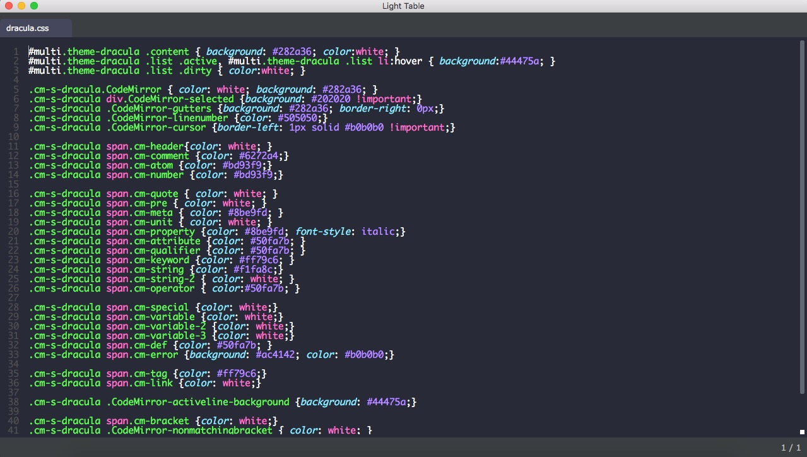

# Dracula for [Light Table](http://lighttable.com)

> A dark theme for [Light Table](http://lighttable.com).

## Install

All instructions can be found at [draculatheme.com/light-table](https://draculatheme.com/light-table).

## Team

This theme is maintained by the following person(s) and a bunch of [awesome contributors](https://github.com/dracula/light-table/graphs/contributors).

 |
--- |
[Damian Kleiman](https://github.com/DamianK) |

## License

[MIT License](./LICENSE)
